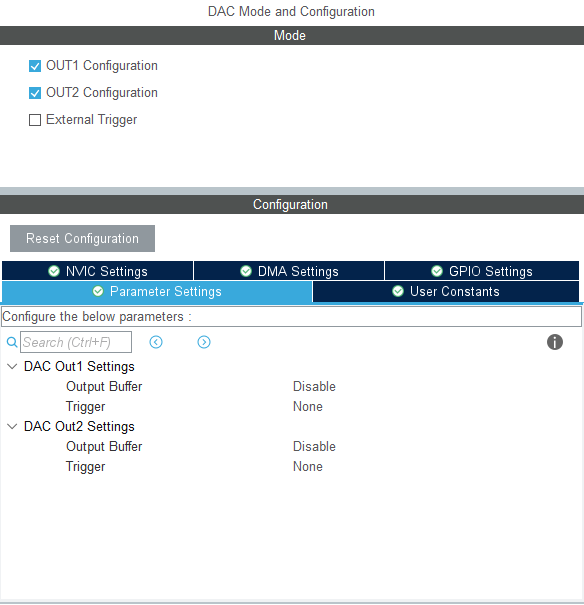
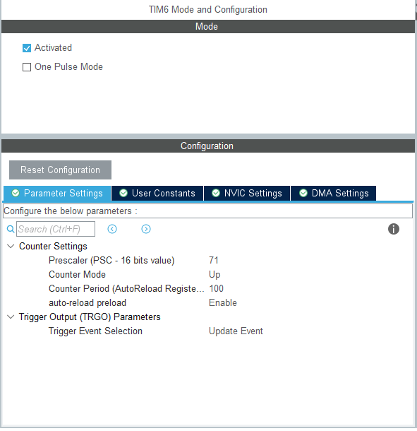
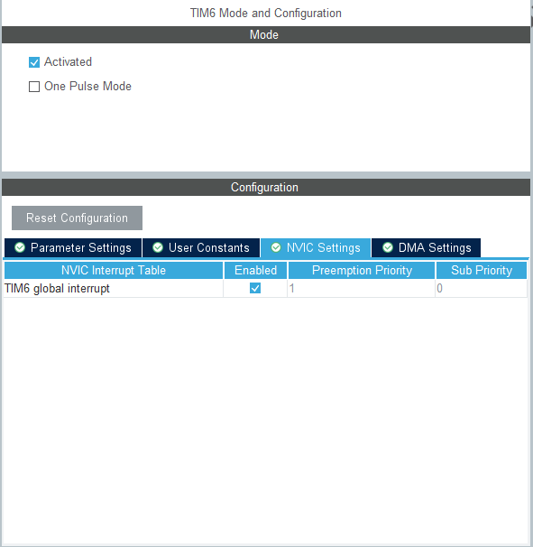
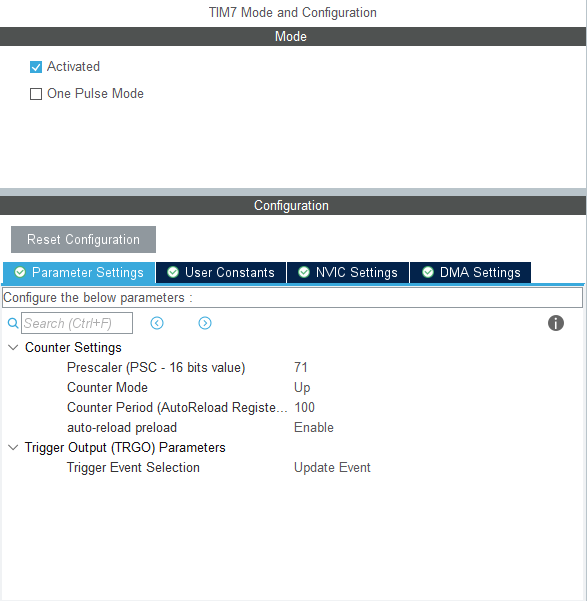
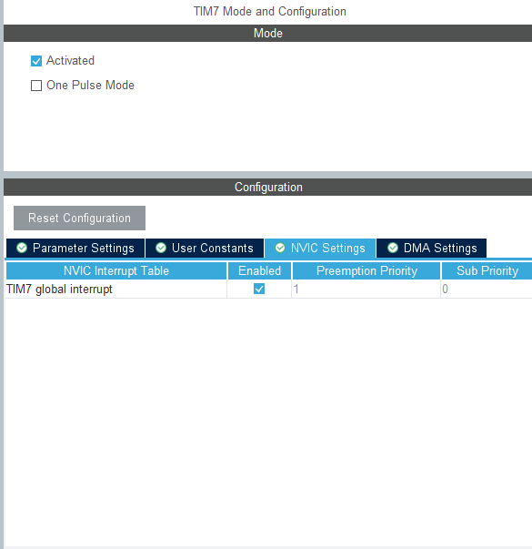
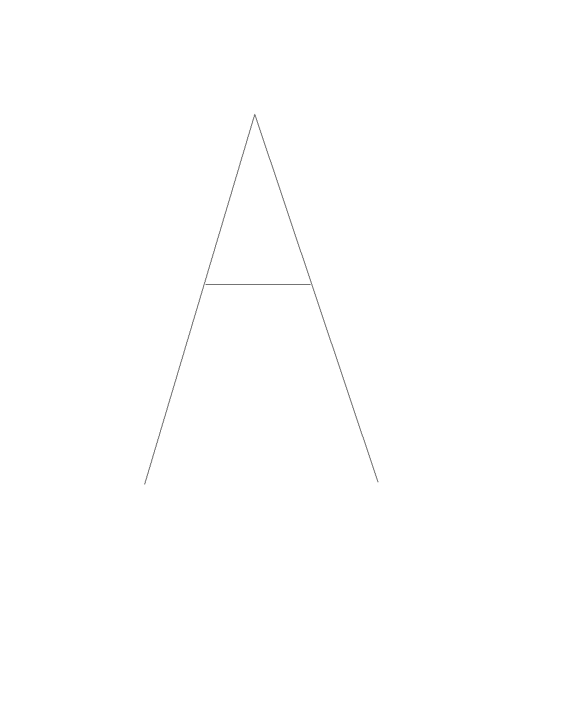

## 示波器X-Y模式显示利萨如(李沙育)与DIY图像

>MUC: STM32F103RCT6
>
>STM32所用库：HAL
>
>涉及编程语言:  C, Python，MATLAB
>
>开发工具：MDK Keil5，CubeMX， PyCharm， MATLAB

[TOC]

#### Lissajous Figures

>   [百度百科-利萨如图形]: https://baike.baidu.com/item/%E5%88%A9%E8%90%A8%E5%A6%82%E5%9B%BE%E5%BD%A2/10517125

**利萨茹(Lissajous)曲线**（又称**利萨茹图形**、**李萨如图形**或**鲍迪奇(Bowditch)曲线**）是两个沿着互相垂直方向的正弦振动的合成的轨迹。

[利萨茹曲线](https://baike.baidu.com/item/利萨茹曲线/4925397)由以下[参数方程](https://baike.baidu.com/item/参数方程)定义：

$$
x(θ)=asinθ
$$

$$
y(θ)=bsin(nθ+φ)
$$

其中

$$
n\geqslant1
$$

且

$$
0\leqslantφ\leqslant\frac{\pi}{2}
$$

n称为曲线的参数，是两个正弦振动的频率比。若比例为有理数，则

$$
n=\frac{q}{p}
$$

参数方程可以写作:

$$
x(θ)=asin(pθ)
$$

$$
y(θ)=bsin(qθ+φ)
$$

$$
0\leqslantθ\leqslant2\pi
$$


###### 我们可以利用python的numpy和matplotlib库在电脑上绘制利萨如图形:

```python
import matplotlib.pyplot as plt
import numpy as np
""" 通过改变x_freq,y_freq,pha三个变量的值可以生成不同的利萨如图形 """
x_freq=2                    # 设置x轴曲线频率(主要是确定xy曲线频率的倍数，此处为 1:2)
y_freq=3                    # 设置y轴曲线频率(主要是确定xy曲线频率的倍数，此处为 1:2)
pha=0 						# 设置xy轴两条正弦曲线的相位差(通过比例设置  0°->0  45°->1/4 															 90°->1/2 135°->3/4 180°->1)
fig=plt.figure(figsize=(1,1))               # 确定画布大小
axs=fig.add_subplot()                       
axs.set(xlim=[-1.2,1.2],ylim=[-1.2,1.2])    # 确定xy轴坐标刻度
theta=np.linspace(0,2*np.pi,1000)           # 0 - 2Π区间等分为1000份
x=np.sin(theta)                             # 得到lissajous图像x轴的正弦曲线
y=np.sin(theta)                             # 得到lissajous图像y轴的正弦曲线
p=x_freq                                         
q=y_freq                                   
n=pha                                        
y=np.sin(q*theta+n*np.pi)                   # 重新确定y值
axs.plot(x,y)                               # 绘图
plt.axis('off')                             # 关闭坐标轴显示
plt.savefig(r'F:\Embedded Development\Software\STM32 Project\Base MKD Keil\Lisaru\image\1x1x0blu.png') 			  # 保存图像到指定路径
```

绘制出的图形如下:


#### 示波器x-y模式：

###### 开启方式：Acquire -> XY -> 被触发的XY ( 如下图 )


###### x-y模式的工作原理：

将两个信号分别输入到示波器的CH1和CH2，以CHI信号的电压作为X正半轴数值，以CH2的电压作为Y正半轴数值，得到的（X,Y)坐标值为显示出来的点。当多个点快速闪现留影，即可形成图像。

#### STM32控制显示利萨如图形：

**方法1：使用STM32F103RCT6自带的DAC在定时器中断中按照正弦波码表双通道输出正弦波，通过改变定时器的psc分频值与arr预重装载值改变DAC输出正弦波的频率，通过改变码表起始位置值来改变相位。**

**方法2：可使用DDS模块输出两路正弦波，通过控制DDS模块改变两个波的频率和相位，从而显示利萨如图形。**

这里采用的是方法1，方法2由于DDS输出两个波的频率若不够精确，会导致相位差累增，而使得显示的图像不断旋转与移动。

###### 正弦波码表

我们使用python得到所需要的正弦波码表：

```python
import matplotlib.pyplot as plt
import numpy as np
import math

# 分辨率（一个正弦波周期内的点数）
POINT_NUM = 256
# 得到pi值
pi = math.pi
# 一个周期 POINT_NUM 个点
n = np.linspace(0, 2*pi, POINT_NUM)
# print(f"n:{n}")
# 计算 POINT_NUM 个点的正弦值
a = list(map(math.sin, n))
# print(f"a:{a}")

r = []
for i in a:
    # 调整幅值在 0~2 区间
    i += 1
    # 按3.3v电压调整幅值
    i /= 2
    i *= 3.3
    # 求取 dac 数值， 12 位 dac LSB = 3.3V/2**12
    ri = round((i/3.3*2**12))
    # 检查参数
    if ri >= 4095:
        ri = 4095
    # 得到 dac 数值序列
    r.append(ri)
# 打印
print(list(map(int,r)))
# 绘图
plt.plot(n,r,"-o")
plt.show()
```

###### CubeMX DAC配置



其余默认即可。

###### CubeMX TIM配置

Trigger Event Selection项可默认不管

###### TIM6





###### TIM7





核心代码如下：

```c
/* 计数器 */
__IO uint16_t SineCodeTimer1 = 0;
__IO uint16_t SineCodeTimer2 = 0;

/* 定时器中断回调函数 */
void HAL_TIM_PeriodElapsedCallback(TIM_HandleTypeDef *htim)
{
	if(Freq_mode == 0)
	{
		if(htim == &htim6)
		{
			if(SineCodeTimer1 + lisa.pha >= 256){
				HAL_DAC_SetValue(&hdac, DAC1_CHANNEL_1, DAC_ALIGN_12B_R, Sine256bit_0[SineCodeTimer1 + lisa.pha - 256]);
				if(SineCodeTimer1 >= 256){
					SineCodeTimer1 = 0;
				}
			}
			else{
				HAL_DAC_SetValue(&hdac, DAC1_CHANNEL_1, DAC_ALIGN_12B_R, Sine256bit_0[SineCodeTimer1 + lisa.pha]);
			}
			SineCodeTimer1++;
		}
		else if(htim == &htim7)
		{
			if(SineCodeTimer2 + lisb.pha >= 256){
				HAL_DAC_SetValue(&hdac, DAC1_CHANNEL_2, DAC_ALIGN_12B_R, Sine256bit_0[SineCodeTimer2 + lisb.pha - 256]);
				if(SineCodeTimer2 >= 256){
					SineCodeTimer2 = 0;
				}
			}
			else{
				HAL_DAC_SetValue(&hdac, DAC1_CHANNEL_2, DAC_ALIGN_12B_R, Sine256bit_0[SineCodeTimer2 + lisb.pha]);
			}
			SineCodeTimer2++;
		}
	}
```

lisa.pha 与lisb.pha是DAC两个通道输出正弦波的相位，其定义在结构体lisaru中(如下)：

```c
typedef struct lisaru{
	uint32_t 	orifreq;	/* 原始频率 */
	uint32_t 	putfreq;	/* 输出频率 */
	uint16_t 	amp;		/* 幅度 */
	uint16_t	pha;		/* 相位 */
}lisaru;
```

其pha的值有如下宏定义：

```c
/*
 * 与正弦波码表相关
 * 计算公式: result = pha / 360 * 256 - 1 （256为码表中点数）
 */
#define PHA_0					0
#define PHA_45					31
#define PHA_90					63
#define PHA_135					95
#define PHA_180					127
```

Sine256bit_0为正弦波码表，如下：

```c
const uint16_t Sine256bit_0[] = {
	2048, 2094, 2140, 2185, 2231, 2277, 2322, 2368, 2413, 2458, 2502, 
	2546, 2591, 2634, 2678, 2721, 2763, 2805, 2847, 2888, 2929, 2969,
	3009, 3048, 3086, 3124, 3161, 3197, 3233, 3268, 3302, 3336, 3369,
	3400, 3432, 3462, 3491, 3520, 3547, 3574, 3600, 3625, 3649, 3672,
	3694, 3715, 3735, 3753, 3771, 3788, 3804, 3819, 3832, 3845, 3856,
	3867, 3876, 3884, 3891, 3897, 3902, 3906, 3908, 3910, 3910, 3909,
	3907, 3904, 3900, 3894, 3888, 3880, 3871, 3862, 3851, 3839, 3826,
	3811, 3796, 3780, 3763, 3744, 3725, 3704, 3683, 3660, 3637, 3613, 
	3587, 3561, 3534, 3506, 3477, 3447, 3416, 3385, 3352, 3319, 3285,
	3251, 3215, 3179, 3142, 3105, 3067, 3028, 2989, 2949, 2909, 2868,
	2826, 2784, 2742, 2699, 2656, 2612, 2569, 2524, 2480, 2435, 2390,
	2345, 2300, 2254, 2208, 2163, 2117, 2071, 2025, 1979, 1933, 1888, 
	1842, 1796, 1751, 1706, 1661, 1616, 1572, 1527, 1484, 1440, 1397, 
	1354, 1312, 1270, 1228, 1187, 1147, 1107, 1068, 1029, 991, 954, 
	917, 881, 845, 811, 777, 744, 711, 680, 649, 619, 590, 562, 535,
	509, 483, 459, 436, 413, 392, 371, 352, 333, 316, 300, 285, 270,
	257, 245, 234, 225, 216, 208, 202, 196, 192, 189, 187, 186, 186,
	188, 190, 194, 199, 205, 212, 220, 229, 240, 251, 264, 277, 292,
	308, 325, 343, 361, 381, 402, 424, 447, 471, 496, 522, 549, 576, 
	605, 634, 664, 696, 727, 760, 794, 828, 863, 899, 935, 972, 1010, 
	1048, 1087, 1127, 1167, 1208, 1249, 1291, 1333, 1375, 1418, 1462,
	1505, 1550, 1594, 1638, 1683, 1728, 1774, 1819, 1865, 1911, 1956,
	2002, 2048,
};
```


###### 改变定时器中断频率，从而改变利萨如两个波的频率比

这里用到两个宏函数：

```c
/* 在运行时设置预分频系数，就是设置预分频器寄存器 TIMx_PSC 的值 */
__HAL_TIM_SET_PRESCALER(&htimx, psc)
/* 在运行时设置自重装载寄存器 TIMx_ARR 的值，并改变定时器的周期 */
__HAL_TIM_SET_AUTORELOAD(&htimx, arr)
```

根据我的开发板计算出的数值：

```c
/* 100Hz : 100Hz *//* 1 : 1 */
__HAL_TIM_SET_PRESCALER(&htim6, 71);
__HAL_TIM_SET_PRESCALER(&htim7, 71);
__HAL_TIM_SET_AUTORELOAD(&htim6, 38);
__HAL_TIM_SET_AUTORELOAD(&htim7, 38);

/* 100Hz : 200Hz */ /* 1 : 2 */
__HAL_TIM_SET_PRESCALER(&htim6, 40);
__HAL_TIM_SET_PRESCALER(&htim7, 40);
__HAL_TIM_SET_AUTORELOAD(&htim6, 67);
__HAL_TIM_SET_AUTORELOAD(&htim7, 33);

/* 100Hz : 300Hz */ /* 1 : 3 */
__HAL_TIM_SET_PRESCALER(&htim6, 10);
__HAL_TIM_SET_PRESCALER(&htim7, 10);
__HAL_TIM_SET_AUTORELOAD(&htim6, 254);
__HAL_TIM_SET_AUTORELOAD(&htim7, 84);

/* 100Hz : 150Hz */ /* 1 : 1.5 */
__HAL_TIM_SET_PRESCALER(&htim6, 10);
__HAL_TIM_SET_PRESCALER(&htim7, 10);
__HAL_TIM_SET_AUTORELOAD(&htim6, 254);
__HAL_TIM_SET_AUTORELOAD(&htim7, 169);
```

将DAC两个通道的引脚分别接在示波器的CH1和CH2上，运行程序后微调示波器x-y的显示，即可看到利萨如图形。（如下图）：


我这里利用串口屏制作了一个界面，可通过串口通信改变示波器显示的利萨如图形：


#### STM32DAC双路输出显示DIY图形：

之前又说到示波器X-Y模式显示的原理，可以简单理解为**在同一时间内两个通道所采集到的电压值分别作为一个点的x与y值**，而后将这个点显示在示波器上。因此若我们想要示波器显示自定义的图像，我们需要**得到图像中每个关键像素点的对应(x,y)坐标，并把这个坐标映射到DAC可输出的电压值区间内（0 - 3.3v 即 0 - 4095）**，从而得到一个具有图像信息的码表。

这里我们使用MATLAB对图像进行二值化处理后导出每个显色像素点对应的坐标值，然后映射到0-4095，从而得到图像的码表（建议图像为线稿，且疏散，附图如下）。




MATLAB脚本代码如下：

```matlab
clc
clear
img=imread('F:\Embedded Development\Software\STM32 Project\Base MKD Keil\Lisaru\image\dx.jpg');   %读取到一张图片
i = imresize(img,[1024,1024]);
[Height,Width]=size(i);                 %获取原图像的高度和宽度
T1=affine2d([-1 0 0;0 1 0;Width 0 1]);  %构造空间变换结构T1，这里为水平镜像变换矩阵
i=imwarp(i,T1);                         %对原图像I进行水平镜像变换  
thresh = graythresh(i);                 %自动确定二值化阈值
i2 = im2bw(i,thresh);                   %对图像二值化

% figure(1)
% imshow(i)     %显示二值化之前的图片
% figure(2)
% imshow(I2)    %显示二值化之后的图片

i3 =~i2;
figure(3)
PicEdge6=edge(i3,'roberts');
PicEdge7=edge(PicEdge6,'roberts');
imshow(PicEdge7)

[m,n] =find(PicEdge7==1);
m = m*4;
n= n*4;
m = 4096-m;
n= 4096-n;
fid = fopen('y.txt','wt');
fprintf(fid,'%g,',m);       
fclose(fid)
fid = fopen('x.txt','wt');
fprintf(fid,'%g,',n);       
fclose(fid)
```

将希望显示的图像经matlab脚本转为对应码表后，同上面显示利萨如图形的操作一样，我们将原先的正弦波码表换成DIY图像码表即可。

为了操作方面我定义了如下结构体和宏函数：

```c
/* 图像对应码表结构体 */
typedef struct lisaru_img_num {
	const uint16_t x[Lisaru_NumSize];		/* x值 */
	const uint16_t y[Lisaru_NumSize];       /* y值 */
	uint32_t len;							/* 码表长度 */
}lisaruimgTypedef;
```

```c
uint16_t lisaru_counts = 0;
#define __Lisaru_Draw_Num(n)					{	HAL_DAC_SetValue(&hdac, DAC1_CHANNEL_1, DAC_ALIGN_12B_R, lisaru_Num[n]->x[lisaru_counts]); \
																				HAL_DAC_SetValue(&hdac, DAC1_CHANNEL_2, DAC_ALIGN_12B_R, lisaru_Num[n]->y[lisaru_counts]); \
																				lisaru_counts++; \
																				if(lisaru_counts >= lisaru_Num[n]->len)lisaru_counts = 0;}
#define __Lisaru_Draw_Alp(n)					{	HAL_DAC_SetValue(&hdac, DAC1_CHANNEL_1, DAC_ALIGN_12B_R, lisaru_Alp[n]->x[lisaru_counts]); \
																				HAL_DAC_SetValue(&hdac, DAC1_CHANNEL_2, DAC_ALIGN_12B_R, lisaru_Alp[n]->y[lisaru_counts]); \
																				lisaru_counts++; \
																				if(lisaru_counts >= lisaru_Alp[n]->len)lisaru_counts = 0;}
```

lisaru_Num 与 lisaru_Alp 为我定义的指针数组：

```c
const lisaruimgTypedef* lisaru_Num[] = {
	&lisaru_img_num_0,
	&lisaru_img_num_1,
	&lisaru_img_num_2,
	&lisaru_img_num_3,
	&lisaru_img_num_4,
	&lisaru_img_num_5,
	&lisaru_img_num_6,
	&lisaru_img_num_7,
	&lisaru_img_num_8,
	&lisaru_img_num_9,
};
const lisaruimgTypedef* lisaru_Alp[] = {
	&lisaru_img_alp_A,
	&lisaru_img_alp_B,
	&lisaru_img_alp_C,
	&lisaru_img_alp_D,
};
```

附上一些完整的图像码表结构体：

*数字6*

```c
lisaruimgTypedef lisaru_img_num_6 = {
	/* 6 */
	.len = 497,
	.x = {
		2656,2656,2656,2656,2656,2656,2656,2656,2640,2640,2640,2640,2640,2640,2640,
		2640,2640,2640,2624,2624,2624,2624,2624,2624,2624,2624,2608,2608,2608,2608,
		2608,2608,2608,2608,2608,2608,2608,2608,2608,2592,2592,2592,2592,2592,2592,
		2592,2576,2576,2576,2576,2576,2576,2576,2560,2560,2560,2544,2544,2544,2544,
		2544,2544,2544,2528,2528,2528,2512,2512,2512,2512,2496,2496,2496,2480,2480,
		2464,2464,2448,2448,2448,2432,2432,2432,2432,2432,2432,2416,2416,2400,2400,
		2384,2384,2384,2384,2368,2368,2352,2352,2352,2336,2336,2336,2320,2320,2320,
		2304,2304,2304,2288,2288,2288,2288,2272,2256,2256,2256,2256,2256,2256,2240,
		2224,2224,2224,2224,2208,2208,2192,2192,2192,2192,2192,2176,2176,2176,2176,
		2160,2160,2160,2160,2160,2144,2144,2128,2128,2112,2112,2112,2112,2096,2096,
		2096,2096,2080,2080,2080,2064,2064,2064,2064,2064,2048,2048,2048,2032,2032,
		2016,2016,2000,2000,1984,1984,1968,1968,1952,1952,1936,1936,1936,1920,1920,
		1920,1920,1920,1904,1904,1904,1888,1888,1888,1872,1872,1872,1872,1872,1872,
		1872,1856,1856,1856,1856,1856,1856,1840,1840,1840,1840,1840,1840,1824,1824,
		1824,1824,1824,1824,1824,1824,1824,1824,1824,1808,1808,1808,1808,1808,1808,
		1808,1808,1808,1792,1792,1792,1792,1792,1792,1792,1792,1792,1792,1792,1776,
		1776,1776,1776,1776,1776,1760,1760,1760,1760,1760,1760,1760,1760,1760,1760,
		1744,1744,1744,1744,1744,1744,1744,1728,1728,1728,1728,1728,1728,1728,1728,
		1728,1728,1728,1712,1712,1712,1712,1712,1712,1712,1696,1696,1696,1696,1696,
		1696,1696,1696,1696,1696,1680,1680,1680,1680,1680,1680,1680,1680,1680,1680,
		1664,1664,1664,1664,1664,1664,1664,1664,1664,1648,1648,1648,1648,1648,1648,
		1648,1648,1648,1632,1632,1632,1632,1632,1632,1632,1632,1616,1616,1616,1616,
		1616,1616,1616,1600,1600,1600,1600,1600,1600,1600,1600,1600,1600,1600,1584,
		1584,1584,1584,1584,1568,1568,1568,1568,1568,1568,1568,1568,1568,1568,1568,
		1552,1552,1552,1552,1552,1552,1552,1552,1552,1536,1536,1536,1536,1536,1536,
		1536,1520,1520,1520,1520,1520,1520,1520,1520,1504,1504,1504,1504,1504,1504,
		1504,1488,1488,1488,1488,1488,1488,1488,1488,1472,1472,1472,1472,1472,1472,
		1472,1472,1456,1456,1456,1456,1456,1456,1456,1456,1456,1440,1440,1440,1440,
		1440,1440,1440,1440,1440,1440,1440,1440,1424,1424,1424,1424,1424,1424,1408,
		1408,1408,1408,1408,1408,1408,1408,1392,1392,1392,1392,1392,1392,1392,1392,
		1392,1392,1376,1376,1376,1376,1376,1376,1376,1376,1376,1376,1376,1376,1376,
		1376,1376,1360,1360,1360,1360,1360,1360,1360,1360,1360,1360,1360,1344,1344,
		1344,1344,1344,1344,1344,1344,1328,1328,1328,1328,1328,1328,1328,1328,1328,
		1328,1328,
	},
	
	.y = {
		1920,1904,1888,1872,1856,1840,1824,1808,2000,1984,1968,1952,1904,1808,1776,
		1760,1744,1728,1984,1904,1872,1856,1808,1712,1696,1680,2032,1984,1952,1936,
		1920,1904,1824,1808,1792,1776,1744,1664,1648,2064,2000,1984,1744,1728,1696,
		1648,2096,2032,2016,1664,1648,1616,1600,2064,2048,1600,2144,2128,2096,2080,
		1616,1600,1568,2128,1552,1536,2144,2128,1536,1520,2160,2144,1520,2176,1504,
		2192,1488,2240,2208,2192,2240,2224,2208,1488,1472,1456,1488,1456,2272,2240,
		2272,1456,1440,1424,1456,1424,2304,2272,1408,2272,1440,1408,2320,2288,1392,
		2288,1424,1392,2352,2336,2304,1392,2304,2352,2336,2320,1408,1392,1376,1360,
		2336,1408,1392,1360,2336,1360,2384,2368,2336,1392,1360,2384,2336,1392,1344,
		2384,2352,1392,1376,1344,2352,1344,2352,1344,2400,2384,2352,1344,2400,2352,
		1360,1344,2400,2368,1376,2368,1376,1360,1344,1328,2368,1376,1328,2368,1328,
		2368,1328,2368,1328,2368,1328,2368,1328,2368,1328,2368,1376,1328,2368,1376,
		1360,1344,1328,2384,2368,1376,2400,1360,1344,3360,3344,2400,2384,2368,2352,
		1344,3328,3312,3296,2400,2352,1344,3360,3280,3264,3248,2352,1344,3360,3344,
		3312,3232,3216,3200,2384,2352,1392,1376,1344,3312,3296,3264,3184,3168,2384,
		2336,1392,1344,3264,3248,3216,3152,3136,3120,2384,2368,2336,1392,1360,3184,
		3104,3088,3072,2336,1360,3184,3168,3136,3056,3040,3024,2336,1408,1392,1360,
		3136,3120,3088,3008,2992,1408,1360,3088,3072,3040,2992,2960,2944,2352,2336,
		2320,1408,1376,2992,2928,2912,2896,2304,1408,1376,3008,2992,2960,2880,2864,
		2848,2352,2336,2304,1376,2960,2944,2912,2832,2816,2800,2288,1440,1424,1392,
		2912,2896,2864,2784,2768,2752,2320,2288,1392,2864,2848,2816,2736,2720,2272,
		1440,1424,1408,2816,2800,2768,2704,2688,2672,2304,2272,2736,2656,2640,2624,
		2256,1456,1424,2736,2720,2688,2608,2592,2576,2288,2256,1456,1440,1424,2688,
		2672,2640,2560,2544,2640,2624,2592,2528,2512,2496,2256,2240,2224,1488,1456,
		2560,2480,2464,2448,2256,2224,1488,1472,1456,2560,2544,2512,2432,2416,2400,
		2208,2512,2496,2464,2384,2368,2352,2192,1488,2464,2448,2416,2336,2320,2176,
		1504,2416,2400,2368,2304,2288,2272,2160,1520,2336,2256,2240,2224,2144,2128,
		1536,1520,2336,2320,2288,2208,2192,2128,2112,1552,1536,2288,2272,2240,2192,
		2160,2112,2096,2080,1616,1600,1568,1552,2240,2224,2144,2112,2080,1600,2176,
		2128,2080,2048,2032,1664,1616,1600,2144,2096,2048,2032,2000,1744,1728,1696,
		1632,1616,2112,2096,2048,2000,1968,1952,1936,1920,1824,1808,1792,1776,1744,
		1664,1648,2064,2048,2000,1920,1888,1872,1856,1808,1712,1696,1680,2016,2000,
		1920,1808,1776,1760,1744,1728,1968,1952,1936,1920,1904,1888,1872,1856,1840,
		1824,1808,
	}
};
```

*字母A*

```c
lisaruimgTypedef lisaru_img_alp_A = {
	/* A */
	.len = 523,
	.x = {
		2736,2736,2736,2720,2720,2720,2704,2704,2704,2704,2704,2688,2688,2688,2688,
		2672,2672,2672,2656,2656,2656,2656,2656,2656,2640,2640,2640,2624,2624,2624,
		2624,2608,2608,2608,2608,2608,2592,2592,2592,2576,2576,2576,2576,2560,2560,
		2560,2560,2560,2544,2544,2544,2544,2544,2528,2528,2528,2528,2512,2512,2512,
		2496,2496,2496,2496,2496,2496,2480,2480,2480,2464,2464,2464,2464,2448,2448,
		2448,2448,2448,2432,2432,2432,2416,2416,2416,2416,2400,2400,2400,2400,2400,
		2384,2384,2384,2384,2384,2368,2368,2368,2368,2352,2352,2352,2336,2336,2336,
		2336,2336,2336,2320,2320,2320,2304,2304,2304,2304,2288,2288,2288,2288,2288,
		2272,2272,2272,2272,2256,2256,2256,2256,2256,2256,2240,2240,2224,2224,2224,
		2224,2208,2208,2208,2208,2208,2192,2192,2192,2192,2192,2192,2176,2176,2176,
		2160,2160,2160,2160,2160,2160,2144,2144,2144,2144,2144,2144,2128,2128,2128,
		2128,2128,2112,2112,2112,2112,2096,2096,2096,2096,2096,2096,2096,2080,2080,
		2080,2080,2064,2064,2064,2064,2064,2048,2048,2048,2048,2048,2048,2032,2032,
		2032,2032,2016,2016,2016,2016,2016,2016,2016,2000,2000,2000,2000,1984,1984,
		1984,1984,1984,1968,1968,1968,1968,1968,1968,1952,1952,1952,1952,1952,1952,
		1936,1936,1936,1936,1936,1920,1920,1920,1920,1904,1904,1904,1904,1904,1888,
		1888,1888,1888,1888,1888,1872,1872,1872,1872,1856,1856,1856,1856,1856,1856,
		1856,1840,1840,1824,1824,1824,1824,1808,1808,1808,1808,1808,1808,1792,1792,
		1792,1792,1792,1792,1776,1776,1776,1776,1776,1776,1776,1760,1760,1760,1760,
		1760,1744,1744,1744,1744,1744,1744,1744,1728,1728,1728,1728,1728,1728,1712,
		1712,1712,1712,1712,1712,1712,1696,1696,1696,1696,1696,1680,1680,1680,1680,
		1680,1680,1664,1664,1664,1664,1664,1664,1664,1648,1648,1648,1648,1648,1632,
		1632,1632,1632,1632,1632,1616,1616,1616,1616,1616,1616,1616,1600,1600,1600,
		1600,1600,1584,1584,1584,1584,1584,1584,1568,1568,1568,1568,1568,1568,1568,
		1552,1552,1552,1552,1552,1536,1536,1536,1536,1536,1536,1536,1520,1520,1520,
		1520,1520,1504,1504,1504,1504,1504,1504,1488,1488,1488,1472,1472,1472,1472,
		1472,1456,1456,1456,1456,1456,1456,1440,1440,1440,1440,1424,1424,1424,1424,
		1424,1424,1408,1408,1408,1408,1408,1392,1392,1392,1392,1392,1392,1376,1376,
		1376,1376,1360,1360,1360,1360,1360,1344,1344,1344,1344,1344,1344,1328,1328,
		1328,1328,1312,1312,1312,1312,1312,1312,1296,1296,1296,1296,1296,1280,1280,
		1280,1280,1280,1280,1264,1264,1264,1264,1248,1248,1248,1248,1248,1232,1232,
		1232,1232,1232,1232,1216,1216,1216,1216,1200,1200,1200,1200,1200,1184,1184,
		1184,1184,1184,1184,1168,1168,1168,1168,1152,1152,1152,1152,1152,1152,1136,
		1136,1136,1136,1136,1120,1120,1120,1120,1120,1120,1104,1104,1104,1104,1088,
		1088,1088,1088,1088,1072,1072,1072,1072,1056,1056,1040,1040,1040,
	},
	.y = {
		1344,1328,1312,1392,1376,1312,1392,1360,1344,1328,1312,1472,1456,1424,1360,
		1472,1392,1376,1552,1536,1504,1440,1424,1408,1552,1472,1456,1584,1520,1504,
		1488,1664,1648,1616,1552,1536,1664,1584,1568,1696,1632,1616,1600,1776,1760,
		1728,1664,1648,1776,1744,1712,1696,1680,1856,1840,1808,1744,1856,1776,1760,
		1936,1920,1888,1824,1808,1792,1936,1856,1840,1968,1904,1888,1872,2048,2032,
		2000,1936,1920,2048,1968,1952,2080,2016,2000,1984,2160,2144,2112,2048,2032,
		2160,2128,2096,2080,2064,2240,2224,2192,2128,2240,2160,2144,2320,2304,2272,
		2208,2192,2176,2320,2240,2224,2352,2288,2272,2256,2432,2416,2384,2320,2304,
		2464,2432,2352,2336,2512,2496,2432,2400,2384,2368,2512,2464,2544,2464,2448,
		2432,2624,2608,2576,2512,2432,2624,2592,2560,2544,2528,2432,2656,2592,2432,
		2736,2720,2688,2624,2608,2432,2736,2704,2672,2656,2640,2432,2816,2800,2768,
		2704,2432,2816,2736,2720,2432,2896,2880,2848,2784,2768,2752,2432,2896,2816,
		2800,2432,2928,2864,2848,2832,2432,3008,2992,2960,2896,2880,2432,3008,2928,
		2912,2432,3088,3072,3040,2976,2960,2944,2432,3088,3008,2992,2432,3120,3056,
		3040,3024,2432,3200,3184,3152,3088,3072,2432,3200,3168,3136,3120,3104,2432,
		3280,3264,3232,3168,2432,3280,3200,3184,2432,3312,3248,3232,3216,2432,3392,
		3376,3344,3280,3264,2432,3424,3312,3296,2432,3424,3392,3376,3360,3344,3328,
		2432,3376,2432,3344,3328,3312,2432,3408,3376,3296,3280,3264,2432,3376,3360,
		3328,3248,3232,2432,3328,3312,3280,3216,3200,3184,2432,3248,3168,3152,3136,
		2432,3248,3232,3200,3120,3104,3088,2432,3200,3184,3152,3072,3056,2432,3152,
		3136,3104,3040,3024,3008,2432,3072,2992,2976,2960,2432,3072,3056,3024,2944,
		2928,2432,3024,3008,2976,2912,2896,2880,2432,2944,2864,2848,2832,2432,2944,
		2928,2896,2816,2800,2432,2896,2880,2848,2784,2768,2752,2432,2816,2736,2720,
		2704,2432,2816,2800,2768,2688,2672,2432,2768,2752,2720,2672,2640,2624,2432,
		2672,2608,2592,2576,2432,2688,2672,2640,2560,2544,2528,2432,2640,2624,2592,
		2512,2432,2592,2576,2544,2464,2448,2432,2512,2416,2400,2512,2496,2448,2384,
		2368,2464,2448,2416,2352,2336,2320,2384,2304,2288,2272,2384,2368,2336,2256,
		2240,2224,2336,2320,2288,2208,2192,2288,2272,2240,2176,2160,2144,2208,2128,
		2112,2096,2208,2192,2160,2080,2064,2160,2144,2112,2048,2032,2016,2080,2000,
		1984,1968,2080,2064,2032,1952,1936,1920,2032,2016,1984,1904,1888,1984,1968,
		1936,1872,1856,1840,1904,1824,1808,1792,1904,1888,1856,1776,1760,1856,1840,
		1808,1744,1728,1712,1776,1696,1680,1664,1776,1760,1728,1648,1632,1728,1712,
		1680,1616,1600,1584,1648,1568,1552,1536,1648,1632,1600,1520,1504,1488,1600,
		1584,1552,1472,1456,1552,1536,1504,1440,1424,1408,1472,1392,1376,1360,1472,
		1456,1424,1344,1328,1424,1408,1376,1312,1344,1312,1344,1328,1312,
	},
};
```

在使用时调用宏函数即可：

```c
	/* image为我定义的一个与串口屏相关的变量，存放图像编号，可不理会 */
	/* 使用时直接调用宏函数即可 */
	switch(image)
	{
		case 20:
			__Lisaru_Draw_Num(0);
			break;
		case 21:
			__Lisaru_Draw_Num(1);
			break;
		case 22:
			__Lisaru_Draw_Num(2);
			break;
		case 23:
			__Lisaru_Draw_Num(3);
			break;
		case 24:
			__Lisaru_Draw_Num(4);
			break;
		case 25:
			__Lisaru_Draw_Num(5);
			break;
		case 26:
			__Lisaru_Draw_Num(6);
			break;
		case 27:
			__Lisaru_Draw_Num(7);
			break;
		case 28:
			__Lisaru_Draw_Num(8);
			break;
		case 29:
			__Lisaru_Draw_Num(9);
			break;
		case 30:
			__Lisaru_Draw_Alp(0);
			break;
		case 31:
			__Lisaru_Draw_Alp(1);
			break;
		case 32:
			__Lisaru_Draw_Alp(2);
			break;
		case 33:
			__Lisaru_Draw_Alp(3);
			break;
	}
```

最终效果如图：


附上一个显示徽标的图，由于徽标原图较为复杂，所以显示出来比较模糊


>   工程源码：https://github.com/JulyCub/lissajous-figure.git
